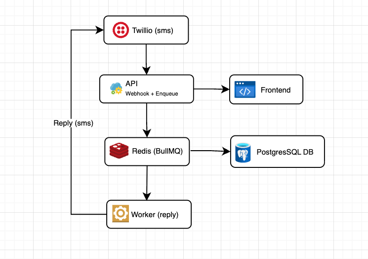
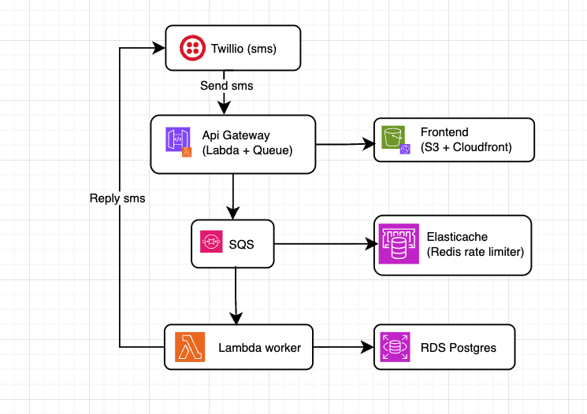

# Architecture

## System Overview

This is a conversational SMS system. A user sends an SMS, the system processes it and the user receives a reply. An admin can view conversation histories through a web interface, the system is composed of six services running in Docker: Postgres, Redis, API, a separate Worker process, a Twilio mock, and the Frontend.

I worked with a similar product at OLX, but instead of only inbound SMS we had a Whatsap conversation service integrated with Amazon Bedrock for AI reply. The solution aimed reaching cold clients so they can reactivate their membership.

We chose using a serverless architecture at the time, because we aimed for 50k users in 3 months as our POC, and using a Lambda made our MVP faster to develop and deploy. I ran the whole service with two queues, S3 (frontend), RDS for database, API gateway and a single Lambda (not ideal but worked) and scaled up for 23.000 clients, for conversations that spammed 30-40 messages each, happened in the timebox of 2 hours each and usually 100/150 conversations at the time. I remember we paid $90 dollars for a month and a half of running service, with 24% of conversion.

So depending on the initial POC goal, I find this a cheap way to test the waters and validate the idea, specially for SMS services if the only processing is persistence and conversations are not that instantaneous, so the ephemerity of lambdas and its cost model would be fit for that scale. As for larger scales, I would go for the architecture I proposed. Its easier to orchestrate the sizing of each service and scale them independently.

---

## Architecture Diagram

The serverless architecture I mentioned before (adapted to this use case).

---

## How I handled the constraints

When a message arrives, the API enqueues it into a BullMQ queue and immediately returns 200. The processing runs asynchronously in a **separate worker container** that dequeues jobs, processes them, and writes to the database. About the deduplication, I enqueue each job by MessageSid and added a unique constraint on the messages table, so if a message is processed twice, the second one will be ignored.

About losing messages, BullMQ jobs are stored in Redis, so if the API crashes the job will be processed later when the worker picks it up. I configured the queue with 3 retries and exponential backoff. Jobs that exhaust all retries are moved to a **dead letter queue** (DLQ) — a separate BullMQ queue — for manual inspection and replay via the `api/admin/dlq` endpoint. In production, if configured to use persistence, Redis can persist the jobs even after restart.

---

## Data Modeling Decisions

Two tables, modeled with TypeORM entities:

### `conversations`

| Column        | Type      | Notes                                      |
| ------------- | --------- | ------------------------------------------ |
| `id`          | UUID      | Primary key, auto-generated                |
| `phoneNumber` | VARCHAR   | Unique — one conversation per phone number |
| `createdAt`   | TIMESTAMP | Auto                                       |
| `updatedAt`   | TIMESTAMP | Auto                                       |

A conversation is keyed by phone number, not by Twilio session. This means all messages from the same number are grouped together, which matches how an admin would naturally think about "a conversation with this person."

### `messages`

| Column             | Type      | Notes                                                                            |
| ------------------ | --------- | -------------------------------------------------------------------------------- |
| `id`               | UUID      | Primary key, auto-generated                                                      |
| `conversationId`   | UUID      | FK → conversations                                                               |
| `twilioMessageSid` | VARCHAR   | Unique, nullable — enables idempotency                                           |
| `direction`        | ENUM      | `inbound` or `outbound`                                                          |
| `body`             | TEXT      | Message content                                                                  |
| `status`           | ENUM      | `received`, `queued`, `processing`, `sent`, `delivered`, `undelivered`, `failed` |
| `createdAt`        | TIMESTAMP | Auto                                                                             |
| `updatedAt`        | TIMESTAMP | Auto                                                                             |

The `twilioMessageSid` unique constraint is the idempotency anchor. The status enum tracks the full lifecycle — inbound messages start at `received`, outbound messages start at `processing` and get updated via Twilio's status callbacks. Note that the database columns use snake_case (`twilio_message_sid`, `conversation_id`) while the TypeORM entities use camelCase, mapped via `@JoinColumn` and `@Column({ name: ... })`.

I chose Postgres over MongoDB because this is a relational domain,conversations contain messages, and the admin queries are relational (list conversations, join to last message, order by recency). Postgres also gives me PACELC consistency guarantees, which matters for not losing or duplicating messages. The latency scales fine for this use case, and Twilio has a good retry policy, so momentary unavailability is tolerable.

Database schema is managed via TypeORM migrations, so they are safe and reversible.

---

## Tradeoffs I Made

- **SSE over polling:** The frontend uses Server-Sent Events (SSE). If I used pooling, most of the requests would use the same data, so it would be a waste of resources. SSE is easy to implement and we can avoid unecessary BE workload

- **Mock Twilio over real Twilio:** I vibecoded a full mock Twilio service that simulates inbound webhooks, outbound SMS sending, and status callbacks with configurable delays. This lets me develop and test the full flow locally without Twilio credentials. The `TwilioService` switches between mock and real mode via a config flag, so switching to production is a config change, not a code change.

- **No authentication:** This seemed like an intern tool, so id just run inside a private subnet first, and then plan auth management.

---

## What I Would Change for Production Scale

- **Redis persistence:** Enable AOF append-only mode so queued jobs survive Redis restarts. Consider Redis Sentinel or Redis Cluster for HA.
- **Monitoring:** Add structured logging (JSON format), metrics (Prometheus / OpenTelemetry), and alerting on queue depth, job failure rate, and webhook latency. BullMQ has built-in metrics that can be exported.
- **Webhook payload persistence:** Write the raw Twilio payload to Postgres immediately as a "pending" record before enqueuing, so there's always a recoverable trail even if Redis is lost. This adds a small synchronous write to the webhook path but provides a stronger durability guarantee.
- **Horizontal scaling:** The API is stateless (no in-memory state beyond the BullMQ connections), so it scales horizontally behind a load balancer. The worker also scales horizontally. BullMQ handles distributed locking

## Testing Strategy

- **Unit tests:** Backend services tested with mocked dependencies — `IntakeService` (`intake.service.spec.ts`), `ConversationsController` (`conversations.controller.spec.ts`), `TwillioController` (`twillio.controller.spec.ts`), and `DlqService` (`dlq.service.spec.ts`). Frontend has lint + build checks.
- **E2e tests:** `conversations.e2e-spec.ts` tests the REST API with a mocked service layer — covers happy path, 400 on invalid UUID, 404 on not found. `app.e2e-spec.ts` verifies the app boots and the health endpoint responds.
- **Stress tests:** Artillery configs for high concurrency, burst traffic, and sustained load. These validate that the webhook stays responsive under load and that the queue absorbs spikes. Run with `make stress`, `make stress-burst`, `make stress-sustained`.
- **Integration testing:** The mock Twilio service has an integration test script (`mock-twilio/tests/integration-test.sh`) that exercises the full webhook → queue → processing → outbound flow end-to-end.

For production, I'd add integration tests with a real Postgres + Redis (via testcontainers), contract tests for the Twilio webhook payload format, and load tests that measure queue depth and processing latency under sustained traffic.
